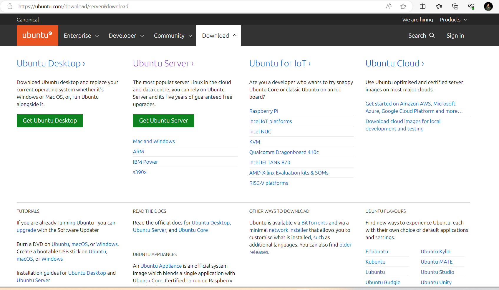

## Home Server Setup Guide

Welcome to my repository for setting up a home server using Ubuntu Server.

### Table of Contents: 
- [Home Server Setup Guide](#home-server-setup-guide)
  - [Table of Contents:](#table-of-contents)
  - [1: Make USB Stick bootable with Ubuntu server](#1-make-usb-stick-bootable-with-ubuntu-server)
    - [1.1: Download Rufus](#11-download-rufus)
    - [1.2: Download Ubuntu Server ISO Image](#12-download-ubuntu-server-iso-image)
    - [1.3: Burning an Ubuntu Server ISO image to USB Drive](#13-burning-an-ubuntu-server-iso-image-to-usb-drive)
  - [2. Install Ubuntu server](#2-install-ubuntu-server)
    - [2.1: Open boot manager and boot using the usb](#21-open-boot-manager-and-boot-using-the-usb)
    - [2.2: Install Ubuntu Server](#22-install-ubuntu-server)
      - [Resources Links](#resources-links)

[Resources Links](#resources-links)

### 1: Make USB Stick bootable with Ubuntu server

#### 1.1: Download Rufus

Download Link: <https://rufus.ie/en/>


#### 1.2: Download Ubuntu Server ISO Image 

Download Link: <https://ubuntu.com/download/server#download>




#### 1.3: Burning an Ubuntu Server ISO image to USB Drive   

`Note: This step will format you USB drive and will make this USB drive a bootable drive i.e. this can't be used for storage purpose, after you are done installing Ubuntu server on computer, you can format this USB drive again to make is again usable for storage purpose`

1. Copy Rufus and Ubuntu Server downloaded files in desktop and close other programs and all folders before proceeding 


 
2. Insert USB (USB Stick) in you computer 
3. Open Rufus
4. Rufus will automatically detect you USB 
5. Select the downloaded ubuntu server iso image
6. Press Start Button `note: there will be some pop-ups just agree to all of them` 
7. Once process is complete, Close the Rufus 
8. Eject USB stick  


### 2. Install Ubuntu server 

In this step we will Install ubuntu server on the computer we are planning to make our server 

#### 2.1: Open boot manager and boot using the usb 

Following is the general guideline to load boot manager and run bootable USB drive. But you should check what works for your computer. 

    Turn on your computer and repeatedly press the key specified for entering BIOS/UEFI settings. 
    Common keys include F2, F12, Del, or Esc. Look for a message on the screen during startup that indicates which key to press.
    Once in the BIOS/UEFI settings, navigate to the "Boot" or "Boot Order" section.
    Set the USB drive as the first boot device or use the boot menu (usually another function key, e.g., F12) to select the USB drive as the boot device for a one-time boot.

Once you select your usb, select option:
`*Try or Install Ubuntu Server`


#### 2.2: Install Ubuntu Server 

Please also make sure you computer is connected with internet (check if your ethernet cable is connected properly)

1. Choose your language 


2. Installer update available (optional)

    Select: `Update to the new installer`, This will download the updates.

3. Keyboard configuration 

    Mostly it will Identify automatically, so you can just press done and move forward 


4. Choose type of install 
    
    Select `Ubuntu Server` and in `Additional options` `select Search for third-party drivers` 


5. Network connection 
    
    You might see two options here first for eth (ethernet) and second wlan (wifi) <br> 
    Go with eth because its better to have hardcoded wired connection with you server


    Setup a static ip address 


    Select Ipv4 Method [Manual] 
        -Subnet: If your subnet is 255.255.255.0 then your CIDR notation is `192.168.1.0/24` 
        -Address: Ip address which is not assigned to any device, check by logging in to your router e.g. `192.168.1.123` 
        -Gateway: Ip address of you router : eg. `192.168.1.1`
        -Name servers: Ip address of you router : eg. `192.168.1.1`
        -Search domains: Keep Empty


6. Configure proxy 


7. Configure Ubuntu archive mirror 

`Keep Default`


8. Guided storage configuration 


Here you can see what is the free space


Don't let there be any free space, assign all space to ubuntu-lv


9. Profile setup 

To be filled with your details 


10. Upgrade to Ubuntu Pro

    Skip 

11. SSH Setup
 
You can also Install openssh-server later. 


12. Third-party drivers 

`Install all third-party drivers` 


13. Feature server snaps 

Ignore for now, lot of the followings we will setup using docker later in this channel


14. Installing system 


15. Installation compete 


Select - `Reboot` 

Remove the bootable USB Stick 

16. Login using Username and password to enter your ubuntu server 

Once Reboot is complete enter your user_name and password 

17. updates

```bash
sudo apt update
sudo apt upgrade
sudo do-release-upgrade
sudo apt-get update && sudo apt-get dist-upgrade
sudo unattended-upgrade
sudo apt autoremove
sudo apt-get autoremove --purge
sudo apt-get clean
sudo snap refresh
sudo dpkg-reconfigure -plow unattended-upgrades
```

18. Setup openssh-server & net-tools install 

```bash
sudo apt install openssh-server
sudo apt install net-tools 
ifconfig 

```


19. Docker installation 

https://docs.docker.com/engine/install/ubuntu/


20. User complete access to /opt

```bash
# create group
sudo groupadd optusers

# add user to the group
sudo usermod -aG optusers pserver

# set permission on the /opt
sudo chown -R root:optusers /opt
sudo chmod -R 775 /opt
sudo chmod g+w /opt

# verify permissions
ls -l /opt

# logout and login

# see users in group 
getent group optusers | cut -d: -f4

```

21. Lid close

```bash
sudo nano /etc/systemd/logind.conf
# make ->
HandleLidSwitch=ignore
```

22. cloudflare

sudo docker run -d --restart always cloudflare/cloudflared:latest tunnel --no-autoupdate run --token

##### Resources Links
Official tutorial Link: <https://ubuntu.com/tutorials/install-ubuntu-server#3-boot-from-install-media> <br>
Other Good tutorial Link: <https://www.tecmint.com/install-ubuntu-20-04-server/> <br>
SSH step: <https://linuxconfig.org/ubuntu-20-04-ssh-server> <br>


